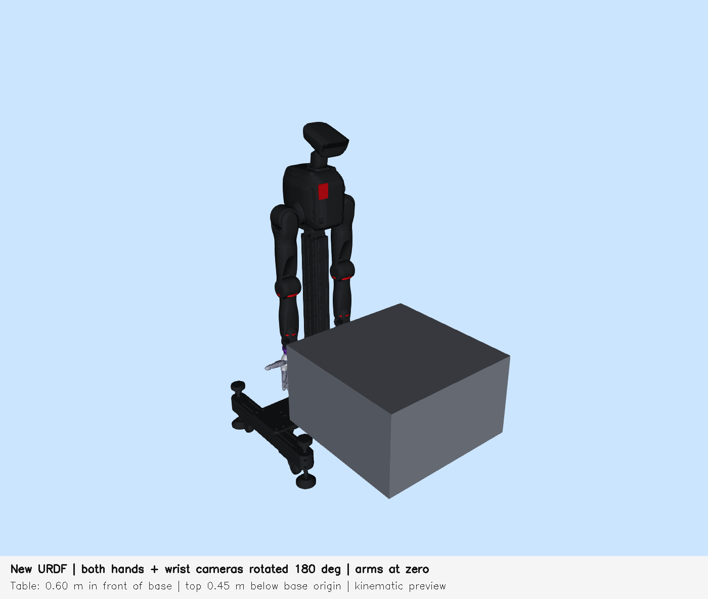
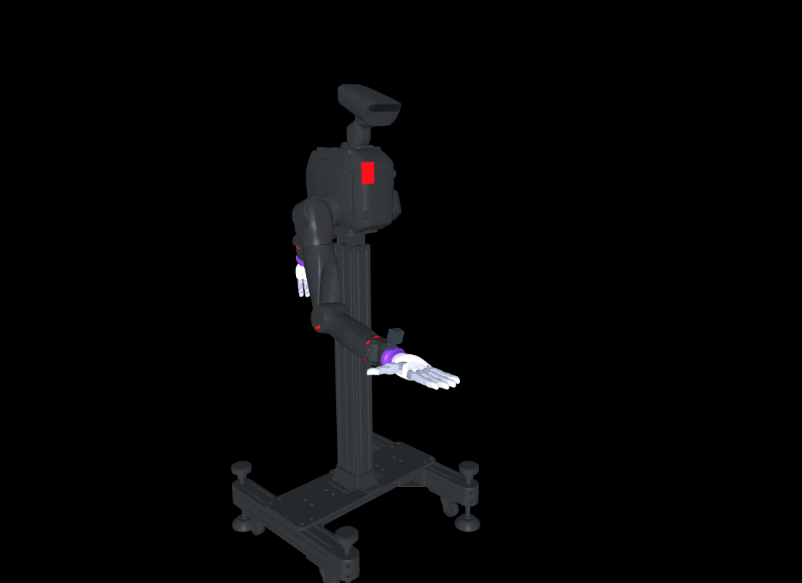

# TRON2 + Revo3 装配模型

[English](README.md) | 简体中文

本仓库提供 DACH_TRON2A 双臂机器人、BrainCo Revo3 双手、手部法兰、V3 腕部相机支架、头部 D455 和两个腕部 D405 的模型、制造 CAD 与运动学预览工具。1.7.1 包含原样发布的 physicsfix 训练 URDF。所需 mesh 已全部随仓库提供，预览无需 CAD 软件、ROS 或额外模型下载。

## 选择模型

| 文件 | 用途 | 可动关节 | 桌面／渲染相机 |
| --- | --- | ---: | --- |
| [`assets/assembly.urdf`](assets/assembly.urdf) | 完整双侧装配 | 58 | URDF 不包含桌面和渲染相机 |
| [`assets/scene.xml`](assets/scene.xml) | 匹配完整模型的 MuJoCo 场景 | 58 | 包含桌面及 6 个 RGB／深度视点 |
| [`assets/assembly_rl_convex.urdf`](assets/assembly_rl_convex.urdf) | physicsfix 右臂／右手训练 articulation | 28 | 不包含桌面和渲染相机 |

双侧手／法兰和腕部相机采用 axis-180 安装：绕父级腕部 link 的局部 Z 纵向中心线旋转 180°，轴线经过 `[-0.0317, 0, 0]` m。该安装轴与可动腕部 roll 关节轴不同。安装平移与关节物理限位保留，头部相机不变。手到法兰的平移为 `[0, 0.023855, 0]` m，左侧 RPY 为 `[-π/2, -π/2, 0]`，右侧为 `[-π/2, +π/2, 0]`。



## 训练拓扑、碰撞体与坐标

训练 URDF 是提供的 `assembly_bilateral_axis180_reduced28_physicsfix.urdf` 的逐字节副本。包含 38 个 link、37 个 joint（28 个 revolute + 9 个 fixed）、78 个 visual、31 个 link 上的 58 个 collision，以及 128 个不同的 mesh 引用。保留 `rl_convex` 文件名以兼容已有配置路径，右掌实际使用 28 个分块碰撞体。

| 碰撞体组 | 元素数 |
| --- | ---: |
| 基座和右臂七个 link | 8 |
| 右手基座／掌部分块 | 28 |
| 右手指分块 | 21 |
| 右 adapter／法兰 | 1 |
| 合计 | 58 |

右臂由近端到远端的七个关节依次为 `proximal_pitch_R_Joint`、`proximal_roll_R_Joint`、`proximal_yaw_R_Joint`、`elbow_R_Joint`、`wrist_yaw_R_Joint`、`wrist_pitch_R_Joint`、`wrist_roll_R_Joint`。右手为拇指 5 个、其余每指 4 个关节。控制映射应按关节名建立，IK／H5／运行配置应绑定 URDF hash；旧 58 维映射或 checkpoint 张量尺寸一致，均不能证明与该 28 关节模型兼容。

头部与左侧几何在降阶时变换到保留的祖先 link，惯性也进行合并；其独立关节及 link／frame 身份已移除。固定姿态如下，单位 rad：

- 头部 yaw 为 `0`、pitch 为 `0.35`；左手所有关节为零。
- 左臂按 pitch／roll／yaw／elbow／wrist-yaw／wrist-pitch／wrist-roll 排列：`1.2395190538964451 0.0050965579201923406 0.0706739400409262 -0.10075078688932715 -0.33794336457190877 -0.6172884125393175 0.5453728186806424`。

五个 fingertip 各有 `0.001 kg` 质量、零 COM、对角惯量 `(1e-10, 1e-10, 1e-9) kg·m²`，非对角项为零。`right_palm` 仍是没有 inertial 的占位 link。此版本同时包含指尖惯性修复与掌部分块碰撞恢复，尚未分别隔离它们对训练的影响。

两个 URDF 的 `world_to_base` 均为 `[0, 0, 1.20035]` m。完整场景桌面顶高为 `0.75035 m`，低于机器人原点 `0.45 m`。physicsfix 训练布局采用基座 Z `0.957 m`、桌面顶高 `0.507 m`，同样相差 `0.45 m`。导入训练 URDF 时应明确设置 world／base／table 布局，避免重复叠加 URDF 的 world offset。训练 URDF 不包含桌面或操作物体，`scene.xml` 对应完整 articulation。



## 安装与启动

已在 Ubuntu 22.04、Python 3.10 上验证。从仓库根目录执行：

```bash
sudo apt install python3-venv python3-tk libgl1 libegl1 libglfw3
python3 -m venv .venv
.venv/bin/python -m pip install -r requirements.txt
```

| 命令 | 显示内容 |
| --- | --- |
| `./viewers/view_adapters.sh` | 左右手法兰 |
| `./viewers/view_camera_brackets.sh` | 左右相机支架，不含相机本体 |
| `./viewers/view_assembly.sh` | 完整装配及桌面 |
| `./viewers/view_cameras.sh` | 三路 RGB 与三路深度 |

```bash
./viewers/view_assembly.sh --model training
./viewers/view_adapters.sh --side left
./viewers/view_camera_brackets.sh --side right
./viewers/view_cameras.sh --width 640 --height 480 --rate 8
```

启动脚本会自行定位仓库环境和资源，也支持从其他目录通过绝对路径启动。请保留完整目录结构。3D 窗口使用 GLFW，相机窗口使用 Tk 和 EGL；无桌面时使用 `--check`。安装对应图形库后也可使用 `MUJOCO_GL=osmesa`。

鼠标左键拖动旋转、右键拖动平移、滚轮缩放。零件窗口中 `1/2/3` 选择左／右／双侧，`F/B/T/U` 选择前／后／顶／腕侧视角，`R` 重置。装配窗口中 `0` 为零位、`1` 为展示姿态、`R` 重置视角。训练模式只改变保留的 28 个关节，已固化几何保持固定。零件与相机预览仅支持完整模型。

全部预览仅执行 forward kinematics，不进行物理步进。原始训练 URDF 的指尖惯量不满足 MuJoCo 的惯量三角检查，因此直接加载会被拒绝。训练预览在内存中的 `MjSpec` 上启用 `balanceinertia`，保持发布 URDF 的字节不变；此预览不能证明 MuJoCo 与 Isaac 的动力学一致。程序调用方式：

```python
import sys
sys.path.insert(0, "viewers")
from _runtime import load_training_model
model = load_training_model()
assert model.nq == 28
```

相机窗口点击 **保存当前图像与深度**，会在 `outputs/<timestamp>/` 保存 RGB PNG、深度 PNG、原始 `_depth_m.npy` 和 `capture.json`（内参、frame、时间及有效像素统计）。可通过 `--output` 指定目录。原始深度为光学坐标系 Z 距离，单位米、类型 `float32`，无效像素为 `NaN`；深度未对齐到彩色图。标称范围为 D455 `0.6–6 m`、D405 `0.07–0.5 m`。相机使用标称视场角的理想针孔模拟，并非已标定的硬件数据流。

## 验证与资产身份

```bash
.venv/bin/python -m unittest discover -s tests -v
./viewers/view_adapters.sh --check --output outputs/check/adapters
./viewers/view_camera_brackets.sh --check --output outputs/check/brackets
./viewers/view_assembly.sh --model full --check --output outputs/check/assembly
./viewers/view_assembly.sh --model training --check --output outputs/check/training
./viewers/view_cameras.sh --check --output outputs/check/cameras
```

[`assets/manifest.json`](assets/manifest.json) 保存每个资产的 SHA256、字节数与上游版本。预览先检查完整性，不会静默重建被修改的模型。[`assets/runtime.json`](assets/runtime.json) 保存模型选择、拓扑、姿态、零件与相机设置。URDF 的精确 SHA256：

```text
assembly.urdf
537f31a798ddb05d1f29e2b5eeede63d47af3d9ff519f40907a24e757f5bbf44
assembly_rl_convex.urdf
2776f52b77dc46ecd27c46894373dfb0dbe41882740f46f9d7b699518d194034
```

测试覆盖完整性、拓扑、关节定义、右侧链 FK、安装关系、桌面高度和预览加载。编译通过与运动学图像不能证明物理抓取成功或策略兼容。使用缓存旧资产的模拟器时需重新导入。

## 目录与 CAD

```text
assets/       URDF、MuJoCo 场景、运行配置和完整性清单
  meshes/     模型引用的视觉和碰撞网格
  cad/
    adapters/        left/right.3mf 与 left/right_print_mm.stl
    camera_brackets/ left/right.step 与 left/right_mm.stl
viewers/      四个启动脚本及共用实现
tests/        发布资产验证
docs/images/  上文引用的完整模型与训练模型预览图
licenses/     上游许可证、声明及许可依据
```

制造交付使用支架 STEP 和法兰 3MF／STL。CAD STL 单位为毫米，仿真 mesh 单位为米；支架制造文件不包含相机本体。结构强度、疲劳、线缆／工具间隙与硬件标定尚未认证，预览工具不会发送硬件控制命令。

生成的截图、日志、虚拟环境与解释器缓存均被忽略。使用说明与模型说明集中在这两份 README，旧开发报告保留在 Git 历史中。来源与许可条件见 [THIRD_PARTY_NOTICES.md](THIRD_PARTY_NOTICES.md)，其中 BrainCo 的许可状态仍未解决。
