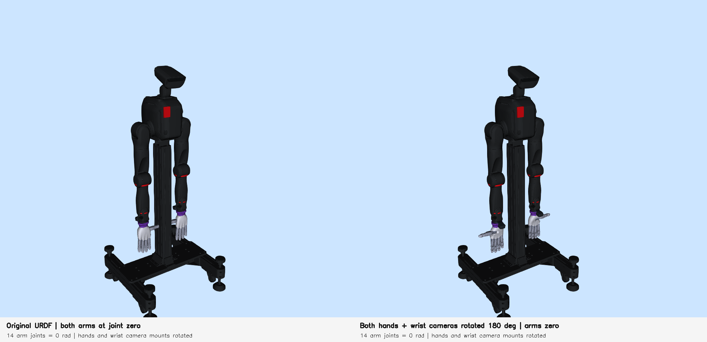

# Bilateral hand and wrist-camera mount rotation (1.4.0)

Both hand/flange assemblies and both wrist-camera assemblies are rotated 180°
from the previous model around the forearm longitudinal centerline. In each
`wrist_roll_*_Link` frame this is the local Z axis passing through
`[-0.0317, 0, 0]` m. This is distinct from the actuated wrist-roll joint axis.
Only the orientations of `left_adapter_mount`, `right_adapter_mount`,
`left_wrist_camera_reference_joint`, and `right_wrist_camera_reference_joint`
change. Root positions, hand-to-flange joints, camera internal transforms,
meshes, actuated joint limits and the head camera remain unchanged.

## Reason for the update

The intended tabletop task holds the right palm down and the fingers pointing
in the robot's forward direction. Changing the mount orientation is intended
to leave greater joint-limit headroom when the arm reaches this posture, rather
than changing physical joint limits. The release verifies the installation
geometry; it does not quantify a larger joint-limit margin or feasible workspace.
Those comparisons require new IK and collision evaluations for this model.
Previous evaluations using different mount directions do not validate this release.

## Files and coordinates

- `assets/assembly.urdf`: default updated model, retaining the public release's
  `world_to_base` origin at Z = 1.20 m.
- `assets/assembly_bilateral_axis180.urdf`: exact approved generated URDF;
  SHA256 `537f31a798ddb05d1f29e2b5eeede63d47af3d9ff519f40907a24e757f5bbf44`.
  Its inherited world origin is Z = 1.20035 m. Apart from that 0.35 mm world
  translation it is identical to the default model.
- `assets/scene.xml`: matching MuJoCo mount orientations, with table top at
  Z = 0.75 m, exactly 0.45 m below the default robot base origin.
- `assets/mount_rotation.json`: rotation provenance and verification results.

The URDF contains the robot; the table is separate scene geometry. The table
preview places its center 0.60 m along base local +X, with zero lateral offset,
and its top 0.45 m below the base origin. The preview uses the exact URDF with
an explicit scene placement; it does not use its inherited world offset.
Both arms are at zero in the preview, so this image is not the palm-down task
posture, an IK feasibility result, or a physics rollout.

The zero-pose comparison confirms unchanged hand-base positions and finger
directions, reversed palm normals, and unchanged camera-to-hand transforms.

